# AWS Multi-AZ Infrastructure Deployment

## Overview

Designed and implemented a production-style AWS infrastructure environment demonstrating compute automation, load balancing, scalable architecture, networking segmentation, storage integration, Infrastructure as Code, and containerized workload deployment.

This project simulates real-world cloud infrastructure design with emphasis on high availability, scalability, and controlled network boundaries.

---

## Architecture Components

* Amazon EC2 (Compute)
* Application Load Balancer (Traffic Distribution)
* Auto Scaling Group (Elastic Scaling)
* Amazon VPC (Network Isolation)
* Public & Private Subnets (Multi-AZ)
* Internet Gateway (External Connectivity)
* Route Tables (Traffic Control)
* Amazon EBS (Persistent Storage)
* Amazon S3 (Static Hosting)
* AWS CloudFormation (Infrastructure as Code)
* Amazon ECS with Fargate (Container Workloads)
* Amazon CloudWatch (Monitoring & Scaling Triggers)

---

## EC2 Initialization and Load Distribution

Automated EC2 instance provisioning using user data scripts to install and configure an Apache web server during instance launch.

Integrated Instance Metadata Service (IMDS) to dynamically render instance-specific information at runtime, enabling validation of instance identity across Availability Zones.

Expanded the architecture using an Application Load Balancer and Auto Scaling Group to distribute incoming traffic and maintain service availability under load conditions.

Load testing triggered CloudWatch metrics, resulting in automatic scaling and balanced traffic distribution across multiple Availability Zones.

### Validation

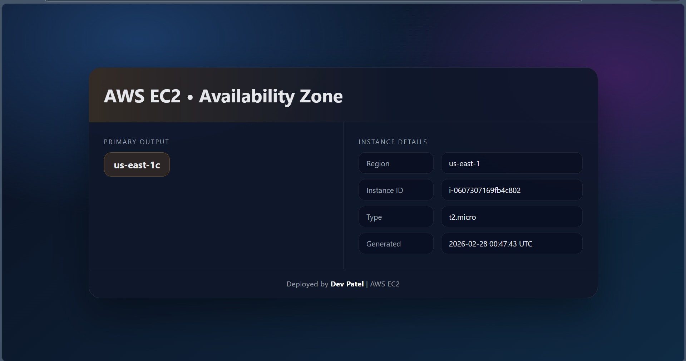

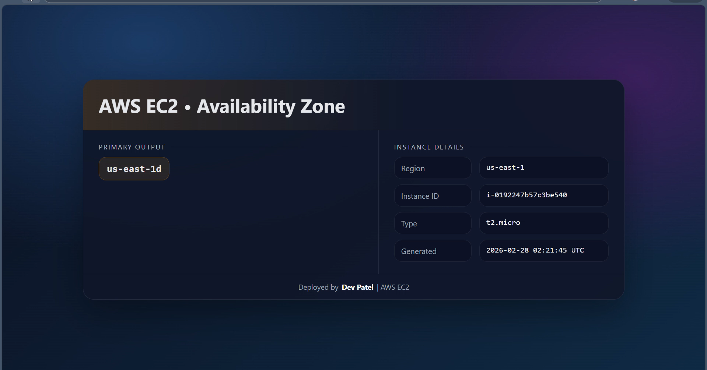

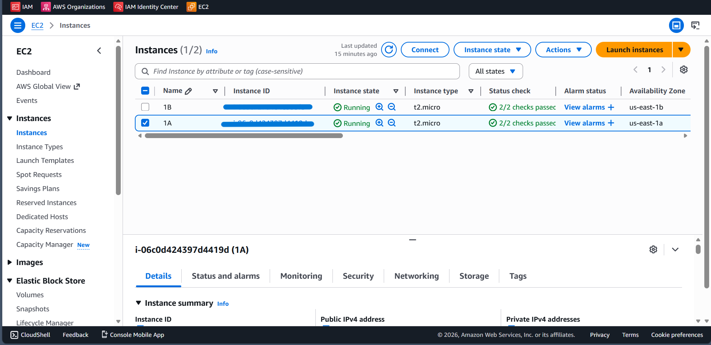

---

## Network Architecture (VPC Design)

Implemented a custom Amazon VPC with structured network segmentation across public and private subnets distributed over multiple Availability Zones.

Configured dedicated route tables to control traffic flow between subnet tiers and external networks.

Established an Internet Gateway and configured explicit `0.0.0.0/0` routing for public subnets, while maintaining isolation for private subnets.

### Key Design Decisions

* CIDR-based IP allocation strategy for scalability
* Separation of public and private workloads
* Controlled ingress/egress routing
* Multi-AZ subnet distribution for high availability

### Validation

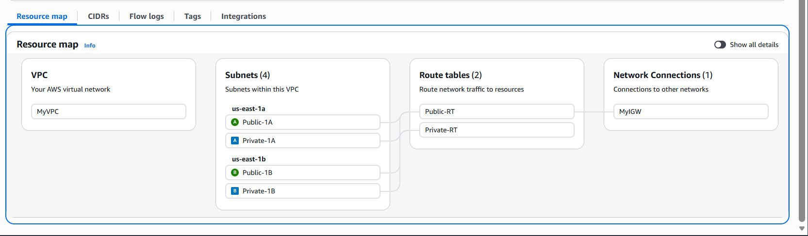
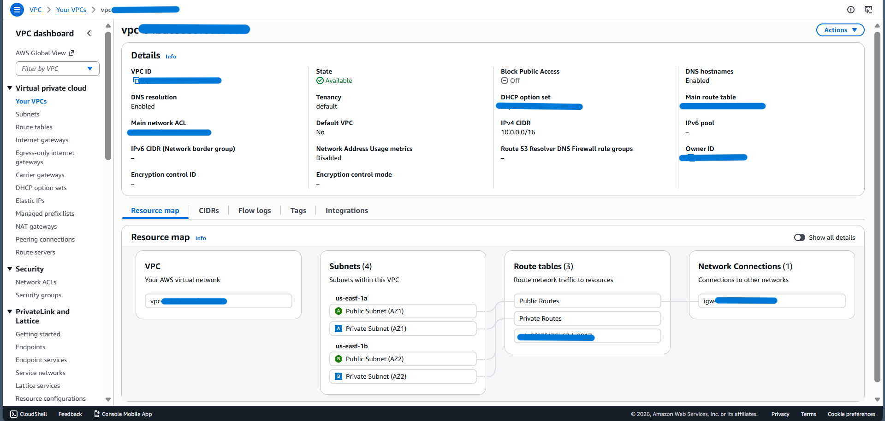
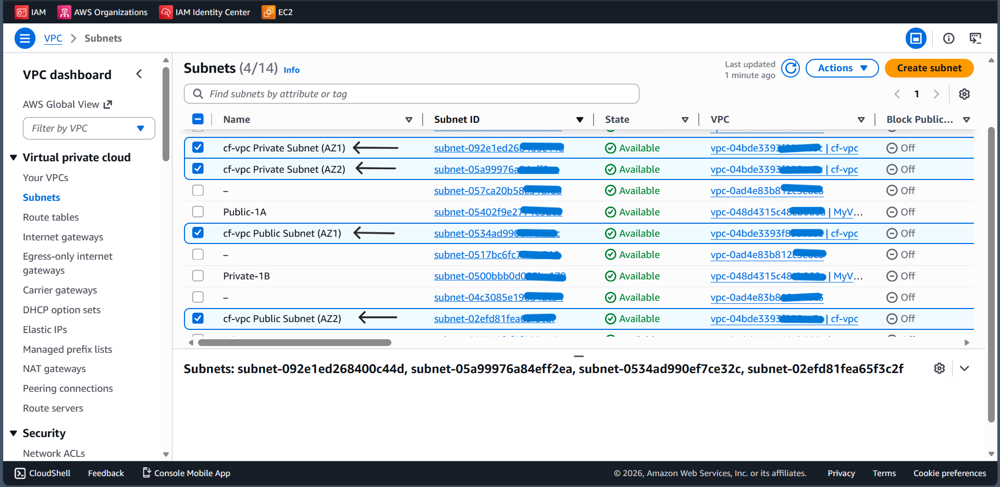
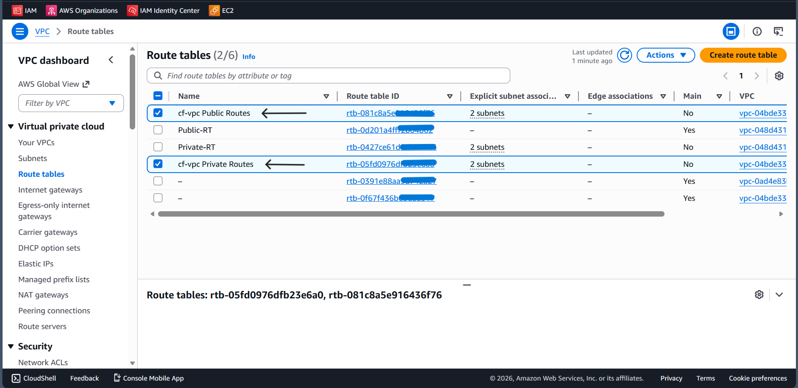
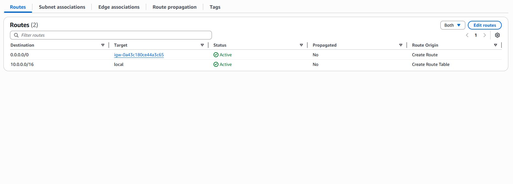
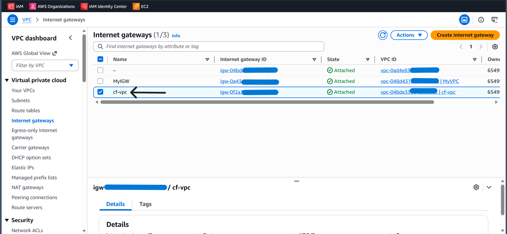

---

## Storage Integration (Amazon EBS)

Provisioned and attached a GP3 EBS volume to a running EC2 instance to demonstrate persistent storage integration.

Validated device recognition at the OS level, created a filesystem, mounted it to `/data`, and verified read/write operations.

### Key Observations

* EBS volumes are Availability Zone scoped
* Storage can be managed independently of compute lifecycle
* Persistent data survives instance termination when configured accordingly

### Validation

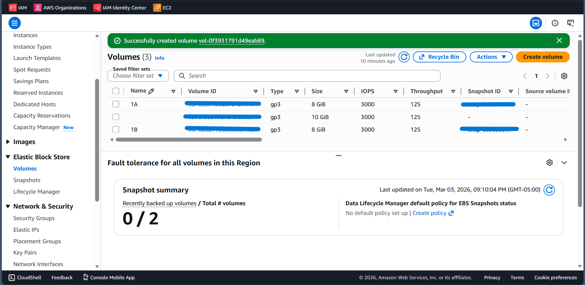
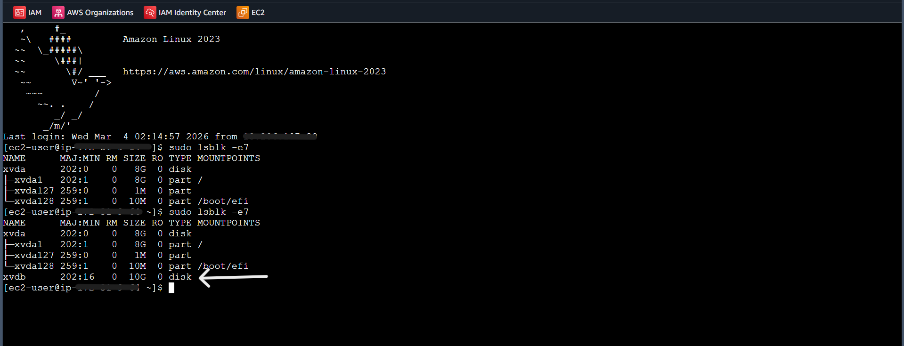

---

## Static Website Hosting (Amazon S3)

Configured static website hosting using Amazon S3 by enabling website hosting and applying controlled public access policies.

Uploaded and validated static content delivery through the S3 website endpoint.

### Key Outcomes

* Direct object delivery from S3 to client browser
* Simplified hosting without server management
* Controlled public access using bucket policies

---

## Infrastructure as Code (AWS CloudFormation)

Implemented infrastructure provisioning using AWS CloudFormation templates written in YAML.

Deployed EC2, VPC, security groups, EBS volumes, and S3 resources through stack operations.

Used Change Sets to safely introduce infrastructure updates.

### Key Benefits

* Declarative infrastructure management
* Repeatable and consistent deployments
* Reduced manual configuration errors

### Validation

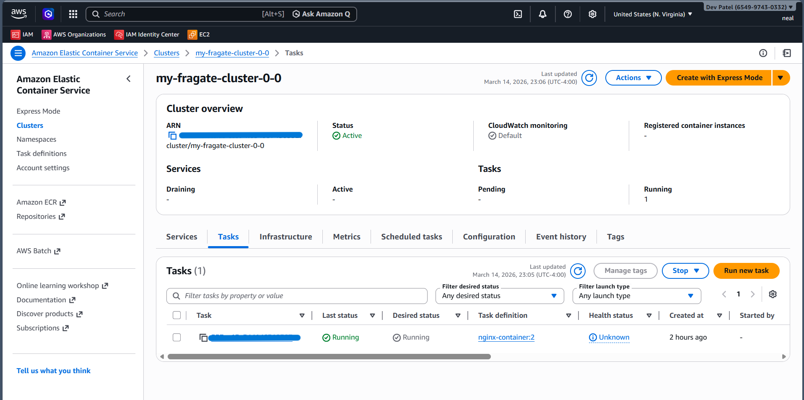
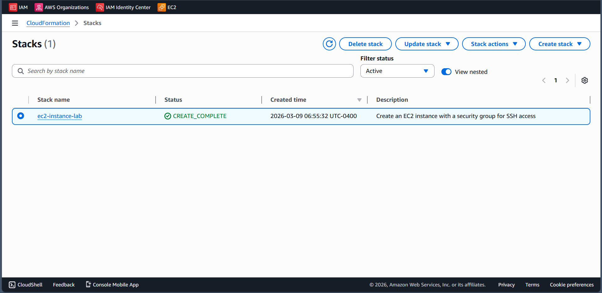
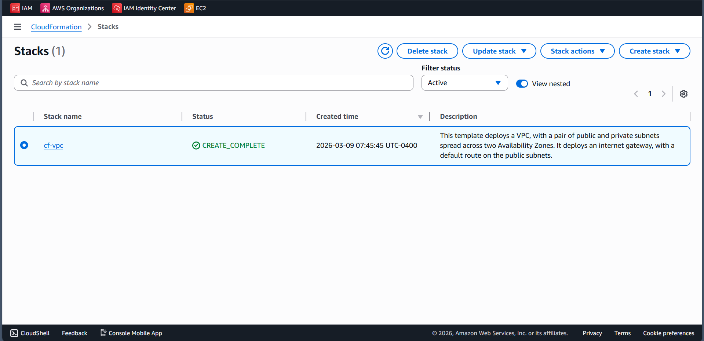

---

## Containerized Workload (ECS Fargate)

Deployed a containerized application using Amazon ECS with the Fargate launch type.

Configured task definitions, networking, and security settings without managing underlying compute infrastructure.

Validated application availability through public endpoint access.

### Key Advantages

* No server management required
* Scalable container execution
* Integrated networking and security controls

### Validation

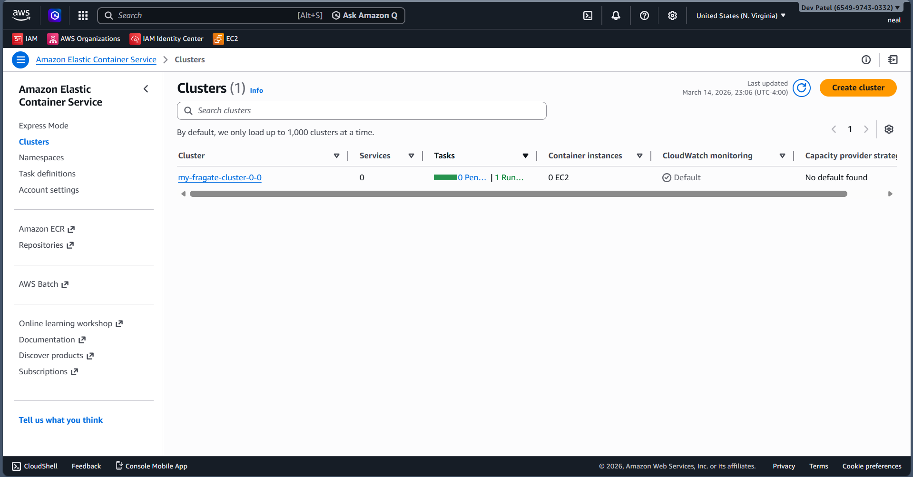
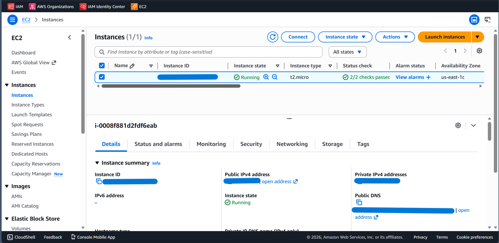
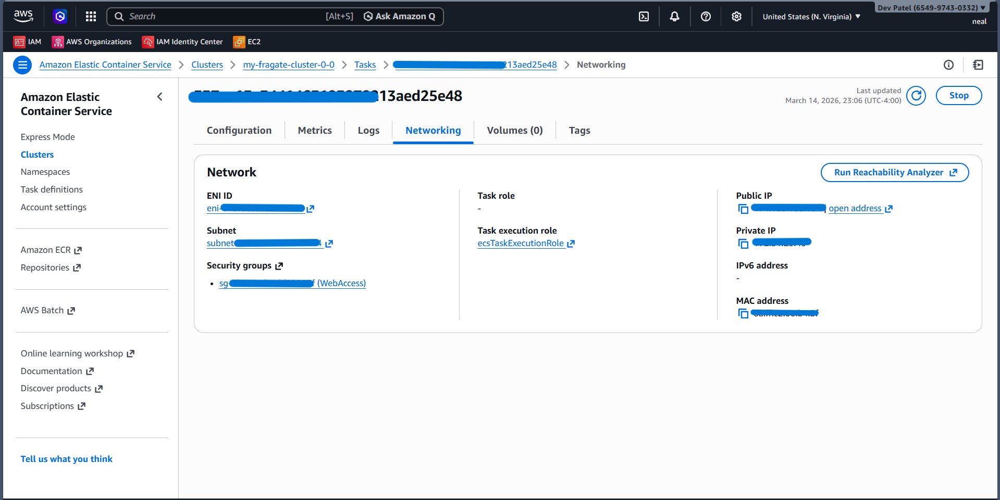
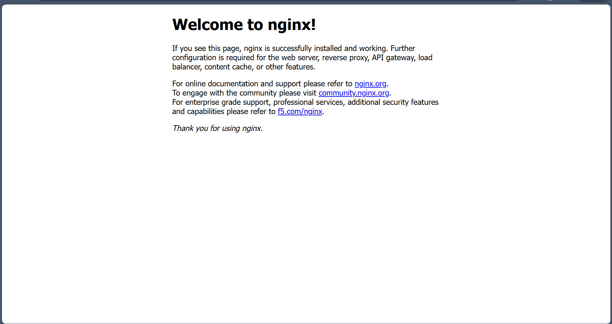

---

## Key Technical Outcomes

* Automated infrastructure provisioning using user data and CloudFormation
* Implemented high availability using multi-AZ architecture
* Achieved dynamic scaling using Auto Scaling and CloudWatch metrics
* Designed structured and secure VPC networking
* Integrated persistent storage with EC2 using EBS
* Delivered static content via Amazon S3
* Executed containerized workloads using ECS Fargate
* Validated full end-to-end infrastructure deployment
